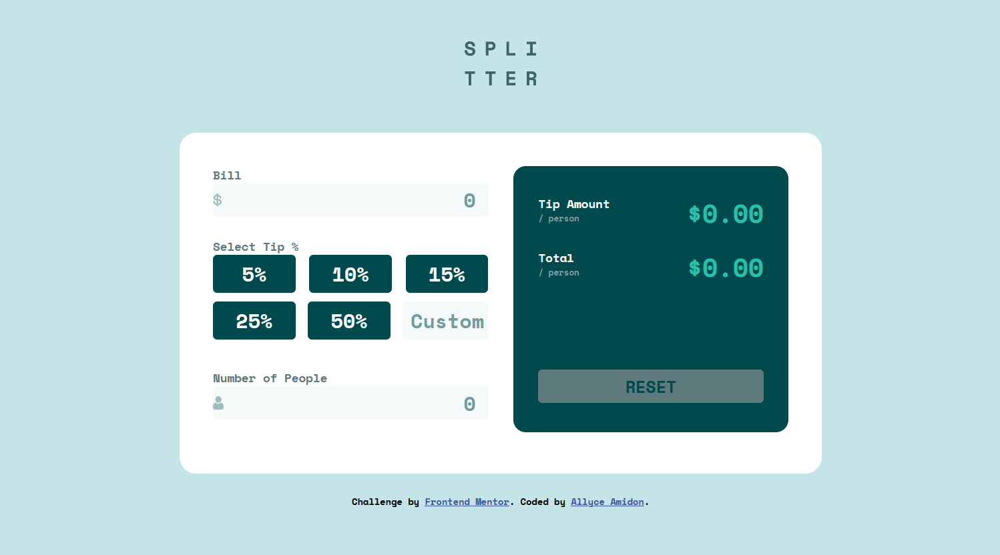
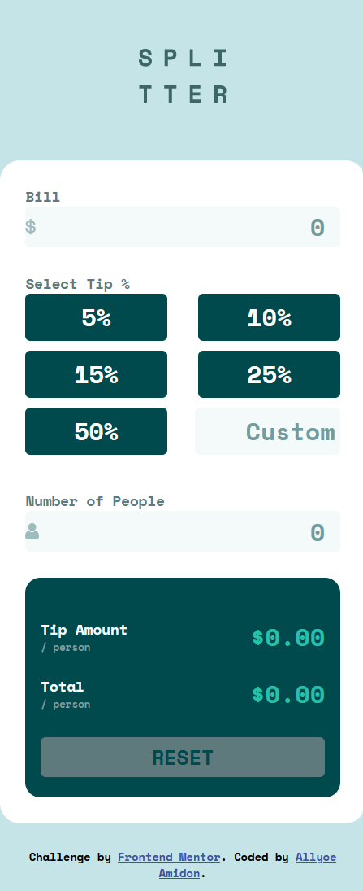

# Frontend Mentor - Tip calculator app solution

This is a solution to the [Tip calculator app challenge on Frontend Mentor](https://www.frontendmentor.io/challenges/tip-calculator-app-ugJNGbJUX). Frontend Mentor challenges help you improve your coding skills by building realistic projects.

## Table of contents

- [Overview](#overview)
  - [The challenge](#the-challenge)
  - [Screenshot](#screenshot)
  - [Links](#links)
- [My process](#my-process)
  - [Built with](#built-with)
  - [Continued development](#continued-development)
- [Author](#author)
- [Acknowledgments](#acknowledgments)

**Note: Delete this note and update the table of contents based on what sections you keep.**

## Overview

### The challenge

Users should be able to:

- View the optimal layout for the app depending on their device's screen size
- See hover states for all interactive elements on the page
- Calculate the correct tip and total cost of the bill per person

### Screenshot

### Links

- Solution URL: [https://github.com/amidona/tip-calculator-app-fm](https://github.com/amidona/tip-calculator-app-fm)
- Live Site URL: [Add live site URL here](https://your-live-site-url.com)

## My process

### Built with

- Semantic HTML5 markup
- CSS custom properties
- Flexbox
- Mobile-first workflow

### Continued development

In future projects I'd like to spend more time on the crossplay between hover vs. focus/active states (i.e., doing one thing when you mouse over and then two different things when you mouse away based on whether you've clicked the element or not).

## Author

- Website - [Allyce Amidon](https://allyceamidon.com/)
- Frontend Mentor - [@amidona](https://www.frontendmentor.io/profile/amidona)
- GitHub - [@amidona](https://github.com/amidona)

## Acknowledgments

Thanks to Reddit user [corgrath](https://www.reddit.com/r/webdev/comments/2kgn2i/comment/cll7f1e/) for the tip on setting an SVG file as the background image of an input.

